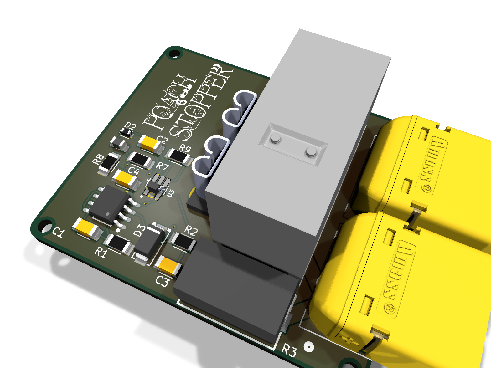

**Inline soft-start for Mini Cheetah motor controllers.**
Stops the power-on inrush surge that kills the input caps.

---

## Why

Cheap MIT Mini Cheetah clones have undersized input caps and no inrush limiting. Hot-plugging a charged battery, current spike into the FETs, caps die. No good, dead cheetah.

Poach Stopper splices inline on the battery lead, pre-charges through a resistor, then hands over full current. No MCU, no firmware, no buttons.

Delay time is calculated to be about `0.24` seconds, but this is due to nearly zero documentation on the knockoff motor's cap bank size, so this is more of a safety number + I think you can wait a quarter second, but if this is not the case, submit an issue.

## How it works

| Block | Parts | Job |
|-------|-------|-----|
| Soft-start bypass | G2RL-1A relay + R3 (10 Ω 5 W) | limits inrush; relay shorts it once charged |
| Delay timer | NE555 monostable mode |
| 5 V rail | LMR16006 buck, 24 V → 5 V | Powers the 555 + relay coil off the pack |
| Protection | Blade fuse F1, 1N4007 flyback D3 | Fault current + coil kickback |

## Build it

JLCPCB order files are in `fab/`:

- `fab/poachstopper-gerbers.zip` — gerbers
- `fab/poachstopper-cpl.csv` — pick-and-place
- `bom/jlcpcb_bom.csv` — assembly BOM (LCSC parts)

**Hand-solder yourself** (not on PnP BOM): R3 (10 Ω 5 W), F1 fuse holder, RLA1 relay, XT60 connectors J1/J2.

Source is KiCad 10 — open `poachstopper.kicad_pro`.

## License

[MIT](LICENSE) © 2026 TheCodedKid
