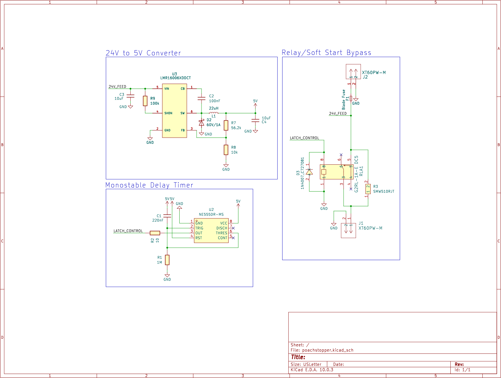
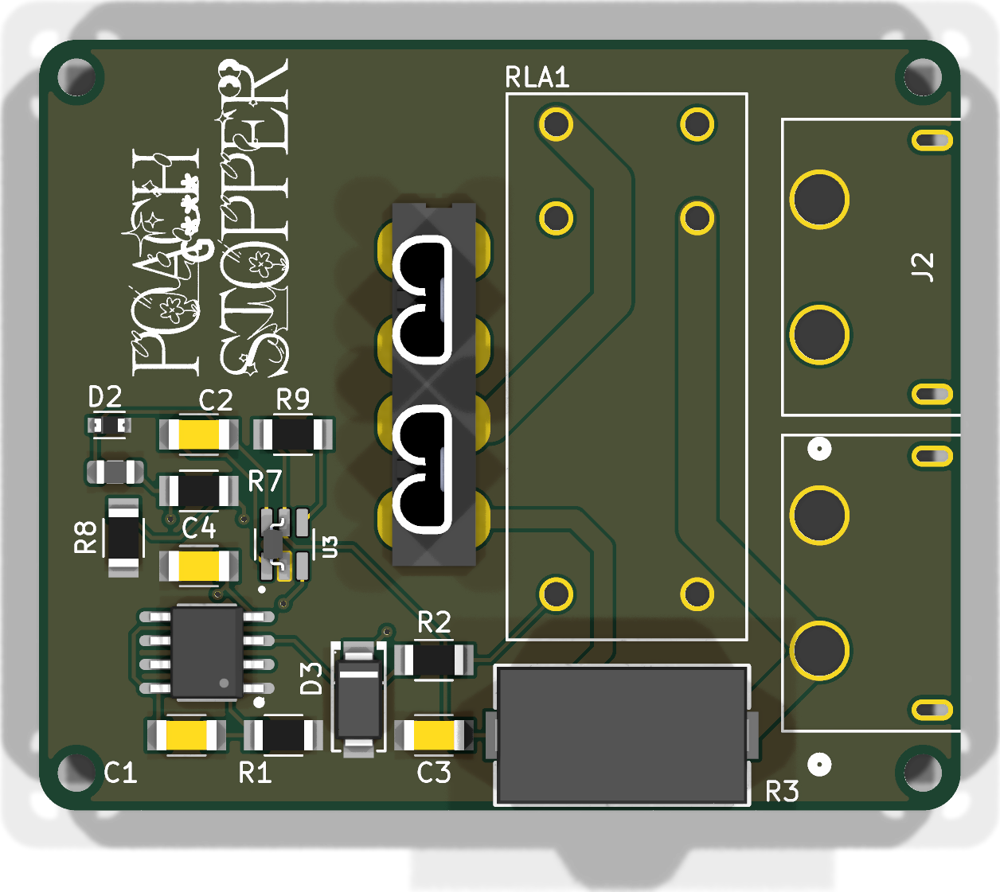

<div align="center">


**Inline soft-start for Mini Cheetah motor controllers.**
Kills the power-on inrush surge that pops the bad input caps.

</div>

---

## The problem

The cheap MIT Mini Cheetah controller clones ship with undersized input
capacitors and no inrush limiting. Hot-plug a charged battery and the caps
slam from 0 V to pack voltage in microseconds — an arc at the connector, a
current spike into the FETs, and a slow death for the caps. Eventually one
lets go.

## The fix

Splice **Poach Stopper** inline on the battery lead. It pre-charges the
controller through a power resistor, *then* hands over full current.

```
BATTERY ──[XT60 J2]──[FUSE]──┬── R3 (10Ω 5W) ──┬──[XT60 J1]── CONTROLLER
                             │                  │
                             └──[ RELAY contact ]┘
                                      ▲
                              closes after ~0.24 s
```

1. **Power on** — relay open. Inrush flows only through **R3**, charging the
   controller caps on a gentle RC curve instead of a dead short.
2. **~0.24 s later** — an NE555 one-shot fires and latches the relay closed,
   shorting out R3 so the motor sees the full, low-resistance battery path.

No microcontroller, no firmware, no buttons. Plug it in and it just works.

## How it works

| Block | Parts | Job |
|-------|-------|-----|
| **Soft-start bypass** | G2RL-1A relay + R3 (`SMW510RJT`, 10 Ω 5 W) | R3 limits inrush; relay shorts it once caps are charged |
| **Delay timer** | NE555 monostable, R1 = 1 MΩ, C1 = 220 nF | `t = R1·C1·ln(3) ≈ 0.24 s` power-on one-shot → latches relay |
| **5 V rail** | LMR16006 buck, 24 V → 5 V | Powers the 555 and relay coil straight off the pack |
| **Protection** | Blade fuse (F1), 1N4007 flyback (D3) | Fault current + relay coil kickback |

> **Tuning the delay:** longer cap charge = bump `R1` or `C1`. The 0.24 s
> default suits the stock clone caps at ~24 V. Bigger caps or higher voltage →
> slow it down, and size R3's wattage to your pack.

<div align="center">

### Schematic


### Board


</div>

## Build it

Everything for a [JLCPCB](https://jlcpcb.com) order is in `fab/`:

- `fab/poachstopper-gerbers.zip` — gerbers
- `fab/poachstopper-cpl.csv` — pick-and-place
- `bom/jlcpcb_bom.csv` — assembly BOM (LCSC parts)

**Hand-solder these yourself** (not on the PnP BOM): `R3` (10 Ω 5 W), `F1`
fuse holder, `RLA1` relay, and the two `XT60` connectors `J1`/`J2`.

Source is KiCad 10 — open `poachstopper.kicad_pro`.

## License

[MIT](LICENSE) © 2026 TheCodedKid
